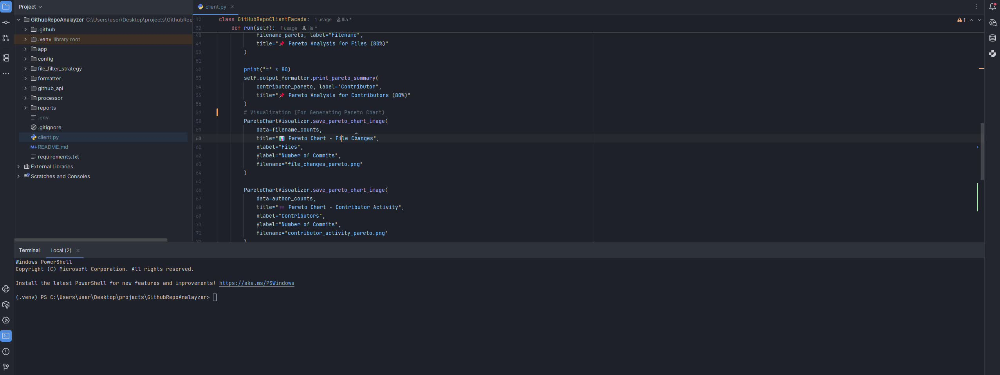

# 🚀 GitHub Repository Optimizer with Pareto Analysis

## 📖 Overview

In most software repositories, a small number of files or contributors typically account for the majority of changes. This project leverages **Pareto Analysis (the 80/20 rule)** to quickly identify:

* The **top 20% of files** that contribute to **80% of the repository changes**.
* The **top 20% of contributors** responsible for about **80% of the commits**.

Understanding these critical files and key contributors helps prioritize resources effectively, enhances code quality, and improves overall project management.

## 🎯 Objectives

* Analyze commit data to determine which files are most frequently changed.
* Identify which contributors make the majority of commits.
* Clearly highlight the most impactful files and contributors using Pareto Analysis.
* Provide two graphs: Pareto Chart - Contributor Activity & File Changes

## 🛠 How It Works

1. **Data Collection**

   * Counts occurrences of file changes across all commits.
   * Counts the number of commits per contributor.

2. **Data Processing**

   * Sorts collected data in descending order based on frequency.
   * Calculates cumulative frequency and percentage.

3. **Pareto Analysis**

   * Identifies the smallest subset of files/contributors that collectively represent at least 80% of the total changes or commits.

4. **Reporting**

   * Generates clearly formatted summaries indicating critical files and key contributors.

5. **GitHub WorkFlow**
   * Can run GitHub Action and can download artifacts containing .png's and description 
   * Typically it is set to run on every sunday (midnight), but user can change it or manually run


## 🚦 Getting Started

### 📥 Installation

### ⚙️ Configuration

Create or update the configuration file (`config.py`):

```python
# config.py
GITHUB_OWNER = 'your-github-username'
GITHUB_REPO = 'repository-name'
GITHUB_TOKEN = 'your-personal-access-token'

```
*  Additionally in "paretoChartVisaulizer.py" on line 7 you can set top_n as you prefer to visualize more in graph 

## 🚀 Quick Start

### 1 · Clone the repository

```bash
git clone https://github.com/yourusername/RepositoryAnalyzer.git
cd RepositoryAnalyzer.git
```

### 2 · Install dependencies

```bash
# (Optional) create an isolated environment
python -m venv .venv
source .venv/bin/activate      # Windows: .venv\Scripts\activate

# Install Python packages
pip install -r requirements.txt
```

### 3 · Run the back‑end client (You can run with this—Here you get an interactive plotted graph)

```bash
python client.py
```

[](assets/terminal-video.mp4)


The CLI collects Git statistics, performs a Pareto analysis, and stores the results

### 4 · Launch the web UI (Or you can run with this—Here you get .png's of a plotted graph)

```bash
uvicorn app.main:app --reload
```

Open [http://127.0.0.1:8000/docs](http://127.0.0.1:8000/docs) for an interactive Swagger UI or visit [http://127.0.0.1:8000](http://127.0.0.1:8000) to browse the dashboard.

[](assets/ui-video.mp4)


---

## 🛠️ GitHub Actions Workflow

Automate the analysis directly in the cloud:

1. Navigate to **GitHub → Actions → Repo Optimizer Pareto Analysis**.
2. Click **Run workflow**.
3. Provide the required inputs (e.g., *repository name*, *GitHub token*, *your github username*).
4. Trigger the run – a detailed report appears in the run artefacts once the job finishes.

---
  

## 📊 Example Output

```
📂 Summary of File Changes Across All Commits:

Filename           | Count | Cumulative Frequency | Cumulative Frequency Percentage (%)
-------------------|-------|----------------------|------------------------------------
main.py            |    12 |                   12 |                             40.00%
utils.py           |     9 |                   21 |                             70.00%
README.md          |     3 |                   24 |                             80.00%

👤 Summary of Contributors Across All Commits:

Contributor Name   | Count | Cumulative Frequency | Cumulative Frequency Percentage (%)
-------------------|-------|----------------------|------------------------------------
ilialataria        |    15 |                   15 |                             50.00%
johndoe            |     8 |                   23 |                             76.67%
janesmith          |     3 |                   26 |                             86.67%
```

## 🧩 Project Structure

```
.
├── app
│    ├── static
│    │    └── favicon.ico
│    │    └── style.css
│    ├── templates
│    │    └── index.html
│    ├── main.py
│    ├── routes.py
│    └── services.py     
├── config
│   └── config.py
├── file_filter_strategy
│   └── dependencyFileFilter.py
├── formatter
│   └── outputFormatter.py
├── github_api
│   └── github_api.py
├── processor
│   └── commitProcessor.py
│   └── ParetoAnalyzer.py
├── client.py
├── .env
└── requirements.txt
```

## 📄 License

This project is licensed under the MIT License.
